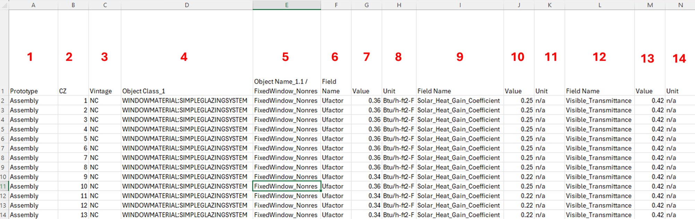
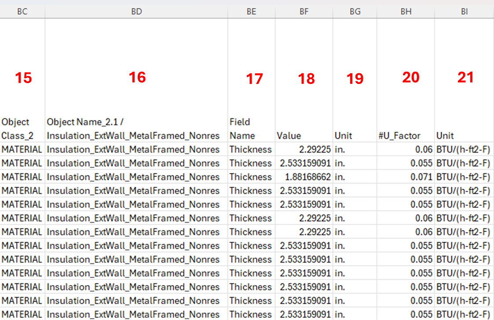

# Data Dictionary

# `Zone.csv`
## General Information

| # | Database Column Name | Value Type | Description |
|---:|---|---|---|
| 1 | **Prototype** | *Text/String* | Building prototype name (e.g., Assembly, RetailMedium). Use to filter which rows apply to which model/run. |
| 2 | **Vintage** | *Text/String* | Code/era bucket (NC, V4, V3-2-1). Use to choose which vintage apply. |

## Zone Info (Object Class_1)

| # | Database Column Name | Value Type | Description |
|---:|---|---|---|
| 3 | **Object Class_1** | *Text/String* | The EnergyPlus Class type: **ZONE** |
| 4 | **Object Name_1.1** | *Text/String* | The EnergyPlus object name for that object class (e.g., Zone name). |
| 5 | **#SpaceType** | *Text/String* | Space-type category label (e.g., “Convention, Conference…”). Use mainly for grouping and naming. |
| 6 | **Field Name** | *Text/String* | Multiplier: A field in the Zone class. |
| 7 | **Value** | *Numeric* | Multiplier value for the specific Zone in the prototype model |
| 8 | **Unit** | *Text/String* | n/a (Multiplier doesn’t have a unit) |
| 9 | **Field Name** | *Text/String* | Floor_Area: A field in the Zone class. |
| 10 | **Value** | *Numeric* | Zone square footage value in the prototype model |
| 11 | **Unit** | *Text/String* | Square Foot |
| 12 | **Field Name** | *Text/String* | Part_of_Total_Floor_Area: A field in the Zone class. Use to calculate the total conditioned floor area in the prototype model. |
| 13 | **Value** | *Text/String* | Yes/No |

## People Info (Object Class_2)

| # | Database Column Name | Value Type | Description |
|---:|---|---|---|
| 14 | **Object Class_2** | *Text/String* | The EnergyPlus class type: **PEOPLE** |
| 15 | **Object Name_2.1** | *Text/String* | Name of the People object for this zone/space (e.g., People_Exhibits and events_Conference Room). Used so the zone can reference this internal load. |
| 16 | **Number_of_People_Schedule_Name** | *Text/String* | Schedule that controls when people are present (fraction 0–1) in the zone during the day. |
| 17 | **Number_of_People_Calculation_Method** | *Text/String* | How the people count is defined (e.g., People/Area). |
| 18 | **People_per_Floor_Area** | *Numeric* | People density input when method is People/Area (units depend on model convention; typically people/ft² ). |
| 19 | **Activity_Level_Schedule_Name** | *Text/String* | Schedule for occupant activity (metabolic rate). Maps to People, Activity Level Schedule Name. |

## Light Info (Object Class_3)

| # | Database Column Name | Value Type | Description |
|---:|---|---|---|
| 20 | **Object Class_3** | *Text/String* | The EnergyPlus Class type: **LIGHT** |
| 21 | **Object Name_3.1** | *Text/String* | Name of the Lights object (e.g., Lights_Theater Area...). Defines lighting internal gains for the zone/space. |
| 22 | **Schedule_Name** | *Text/String* | Lighting schedule (fraction 0–1) controlling the lighting load in the zone. Maps to Lights, Schedule Name. |
| 23 | **Design_Level_Calculation_Method** | *Text/String* | Method used to define lighting power (e.g., Watts/Area). Maps to Lights, Design Level Calculation Method. |
| 24 | **Lights_Wattes_per_Floor_Area** | *Numeric* | Lighting power density value when method is Watts/Area. Maps to Lights, Watts per Zone Floor Area. |
| 25 | **Unit** | *Text/String* | Units label for the lighting input (commonly W/ft² in zone.csv; used for conversion/QA). |
| 26 | **End_Use_Subcategory_3.1** | *Text/String* | End-use tag for reporting (e.g., ComplianceLtg). Maps to Lights, End-Use Subcategory. |

## Electric Equipment Info (Object Class_4)

| # | Database Column Name | Value Type | Description |
|---:|---|---|---|
| 27 | **Object Class_4** | *Text/String* | The EnergyPlus Class type: **ELECTRICEQUIPMENT** |
| 28 | **Object Name_4.1** | *Text/String* | Name of the plug-load ElectricEquipment object (receptacle/plug load). Used to define general electric internal gains. |
| 29 | **Schedule_Name** | *Text/String* | Plug-load schedule (fraction 0–1) in the zone. Maps to ElectricEquipment, Schedule Name. |
| 30 | **Design_Level_Calculation_Method** | *Text/String* | Method used to define plug load (e.g., Watts/Area). Maps to ElectricEquipment, Design Level Calculation Method. |
| 31 | **Equip_Wattes_per_Floor_Area** | *Numeric* | Plug-load power density value when method is Watts/Area. Maps to ElectricEquipment, Watts per Zone Floor Area. |
| 32 | **Unit** | *Text/String* | Units label for plug-load input (commonly W/ft²). |
| 33 | **End_Use_Subcategory_4.1** | *Text/String* | End-use tag for reporting (e.g., Receptacle). Maps to ElectricEquipment, End-Use Subcategory. |
| 34 | **Object Name_4.2** | *Text/String* | Name of the refrigeration load object (often modeled as a second ElectricEquipment object). |
| 35 | **Schedule_Name** | *Text/String* | Refrigeration schedule (fraction 0–1) in the zone. Maps to ElectricEquipment, Schedule Name for that refrigeration object. |
| 36 | **Design_Level_Calculation_Method** | *Text/String* | Method used (e.g., Watts/Area). Maps to ElectricEquipment, Design Level Calculation Method. |
| 37 | **Refrig_Wattes_per_Floor_Area** | *Numeric* | Refrigeration power density value when method is Watts/Area. Maps to ElectricEquipment, Watts per Zone Floor Area. |
| 38 | **Unit** | *Text/String* | Units label (commonly W/ft² in zone.csv; used for conversion/QA). |
| 39 | **End_Use_Subcategory_4.2** | *Text/String* | End-use tag for reporting (e.g., Refrigeration). Maps to ElectricEquipment, End-Use Subcategory. |

## Gas Equipment Info (Object Class_5)

| # | Database Column Name | Value Type | Description |
|---:|---|---|---|
| 40 | **Object Class_5** | *Text/String* | The EnergyPlus Class type: **GASEQUIPMENT** |
| 41 | **Object Name_5.1** | *Text/String* | Name of the GasEquipment object (e.g., cooking/process gas loads if any). |
| 42 | **Schedule_Name** | *Text/String* | Gas equipment schedule (fraction 0–1) in the zone. Maps to GasEquipment, Schedule Name. |
| 43 | **Design_Level_Calculation_Method** | *Text/String* | Method used to define the gas load (e.g., Power/Area). Maps to GasEquipment, Design Level Calculation Method. |
| 44 | **Gas_Power_per_Floor_Area** | *Numeric* | Gas load density when method is Power/Area. Maps to GasEquipment, Power per Zone Floor Area. |
| 45 | **Unit** | *Text/String* | Units label for gas power density (often Btu/hr-ft² in Zone.CSV). |
| 46 | **End_Use_Subcategory_5.1** | *Text/String* | End-use tag for reporting (e.g., Gas). Maps to GasEquipment, End-Use Subcategory. |

## Zone Infiltration Info (Object Class_6)

| # | Database Column Name | Value Type | Description |
|---:|---|---|---|
| 47 | **Object Class_6** | *Text/String* | The EnergyPlus Class type: **ZONEINFILTRATION:DESIGNFLOWRATE** |
| 48 | **Object Name_6.1** | *Text/String* | Name of the infiltration object for the zone. |
| 49 | **Schedule_Name** | *Text/String* | Infiltration schedule (fraction 0–1) in the zone. Maps to ZoneInfiltration:DesignFlowRate, Schedule Name. |
| 50 | **Design_Level_Calculation_Method** | *Text/String* | Infiltration method (e.g., Flow/ExteriorWallArea or AirChanges/Hour). Maps to ZoneInfiltration:DesignFlowRate, Design Flow Rate Calculation Method. |
| 51 | **Infil_Air_Change_per_hour** | *Numeric* | ACH value used only when method is AirChanges/Hour. Maps to ZoneInfiltration:DesignFlowRate, Air Changes per Hour. |
| 52 | **Infil_Flow_Rate_per_Exterior_Surface_Area** | *Numeric* | Flow per exterior surface area used when method is Flow/ExteriorWallArea. Maps to ZoneInfiltration:DesignFlowRate, Flow per Exterior Surface Area. |

## Zone Ventilation Info (Object Class_7)

| # | Database Column Name | Value Type | Description |
|---:|---|---|---|
| 53 | **Object Class_7** | *Text/String* | The EnergyPlus Class type: **DESIGNSPECIFICATION:OUTDOORAIR** |
| 54 | **Object Name_7.1** | *Text/String* | Name of the outdoor air specification object tied to the zone. |
| 55 | **Outdoor_Air_Method** | *Text/String* | How OA is calculated (e.g., Maximum). Maps to DesignSpecification:OutdoorAir, Outdoor Air Method. |
| 56 | **Outdoor_Airflow_per_Person** | *Numeric* | OA rate per personin the zone. Maps to DesignSpecification:OutdoorAir, Outdoor Air Flow per Person. |
| 57 | **Outdoor_Airflow_per_Zone_Floor_Area** | *Numeric* | OA rate per floor area in the zone. Maps to DesignSpecification:OutdoorAir, Outdoor Air Flow per Zone Floor Area. |
| 58 | **Outdoor_Airflow_per_Zone** | *Numeric* | Fixed OA flow per zone. Maps to DesignSpecification:OutdoorAir, Outdoor Air Flow per Zone. |
| 59 | **Outdoor_Air_Schedule_Name** | *Text/String* | Availability schedule that can scale OA (fraction 0–1). Maps to DesignSpecification:OutdoorAir, Outdoor Air Schedule Name. |

## Water Use Equipment Info (Object Class_8)

| # | Database Column Name | Value Type | Description |
|---:|---|---|---|
| 60 | **Object Class_8** | *Text/String* | The EnergyPlus Class type: **WATERUSE:EQUIPMENT** |
| 61 | **Object Name_8.1** | *Text/String* | Name of the zone/space hot-water end-use object. |
| 62 | **#Water_Heater_Type** | *Text/String* | Water heater classification (Gas/Electric/HP). Used by the workflow to choose which water heater + plant loop objects to generate; not a direct WaterUse:Equipment numeric field. |
| 63 | **Flow_Rate_Fraction_Schedule_Name** | *Text/String* | Schedule (fraction 0–1) scaling hot water draw. Maps to WaterUse:Equipment, Flow Rate Fraction Schedule Name. |
| 64 | **Target_Temperature_Schedule_Name** | *Text/String* | Schedule defining desired hot water temp. Maps to WaterUse:Equipment, Target Temperature Schedule Name. |
| 65 | **Peak_Flow_Rate** | *Numeric* | Peak hot water flow rate for this end use. Maps to WaterUse:Equipment, Peak Flow Rate. |

## Thermostat Setpoint Info (Object Class_9)

| # | Database Column Name | Value Type | Description |
|---:|---|---|---|
| 66 | **Object Class_9** | *Text/String* | The EnergyPlus Class type: **THERMOSTATSETPOINT:DUALSETPOINT** |
| 67 | **Object Name_9.1** | *Text/String* | Name of the dual setpoint thermostat object assigned to the zone. |
| 68 | **Heating_SetPoint_Schedule_Name** | *Text/String* | Heating setpoint schedule. Maps to ThermostatSetpoint:DualSetpoint, Heating Setpoint Temperature Schedule Name. |
| 69 | **Cooling_SetPoint_Schedule_Name** | *Text/String* | Cooling setpoint schedule. Maps to ThermostatSetpoint:DualSetpoint, Cooling Setpoint Temperature Schedule Name. |

# `Whole_Bldg.csv`
## General Information

| # | Database Column Name | Value Type | Description |
|---:|---|---|---|
| 1 | **Prototype** | *Text/String* | Building prototype name (e.g., Assembly, RetailMedium). Use to filter which rows apply to which model/run. |
| 2 | **Vintage** | *Text/String* | Code/era bucket (NC, V4, V3-2-1). Use to choose which vintage apply. |

## Ext. Lights Info (Object Class_1)

| # | Database Column Name | Value Type | Description |
|---:|---|---|---|
| 3 | **Object Class_1** | *Text/String* | The EnergyPlus Class type: **EXTERIOR:LIGHTS** |
| 4 | **Object Name_1.1** | *Text/String* | The EnergyPlus object Name for that object class (e.g., exterior lighting object name). |
| 5 | **Schedule_Name** | *Text/String* | The schedule that controls when lights are on; typically 0–1. Maps to Ext:Lights, Schedule Name. |
| 6 | **Design_Level** | *Text/String* | Method used to define Ext. lighting power, full power when schedule = 1.(e.g., Watts/Area). Maps to Exterior:Lights, Design Level. |
| 7 | **Unit** | *Numeric* | Units for Design_Level (typically W). |
| 8 | **Control_Option** | *Text/String* | Ext Light Control Option (e.g., AstronomicalClock, ScheduleNameOnly). |
| 9 | **End_Use_Subcategory_1.1** | *Text/String* | End-use tag for reporting : Exterior:Lights, End-Use Subcategory. |

## Ext. Fuel Equipment Info (Object Class_2)

| # | Database Column Name | Value Type | Description |
|---:|---|---|---|
| 10 | **Object Class_2** | *Text/String* | The EnergyPlus Class type: **EXTERIOR:FUELEQUIPMENT** |
| 11 | **Object Name_2.1** | *Text/String* | The EnergyPlus object Name for that object class (e.g., elevator load object name). |
| 12 | **Fuel_Use_Type** | *Text/String* | Fuel Use Type (e.g., Electricity, NaturalGas). |
| 13 | **Schedule_Name** | *Text/String* | The schedule that scales the load over time; typically 0–1, Maps to Exterior:FuelEquipment, Schedule Name (). |
| 14 | **Design_Level** | *Numeric* | Method used to define Ext.FuelEquipment, Design Level = peak rate when schedule = 1. |
| 15 | **Unit** | *Text/String* | Units for Design_Level (typically W for Electricity). |
| 16 | **End_Use_Subcategory_2.1** | *Text/String* | End-use tag for reporting: Exterior:FuelEquipment, End-Use Subcategory (reporting label, e.g., Elevators). |

## Water Heater Info (Object Class_3)

| # | Database Column Name | Value Type | Description |
|---:|---|---|---|
| 17 | **Object Class_3** | *Text/String* | The EnergyPlus Class type: **WATERHEATER:MIXED** |
| 18 | **Object Name_3.1** | *Text/String* | The EnergyPlus object Name for that object class (e.g., NonResBaseGasWaterHeater). |
| 19 | **Tank_Volume** | *Numeric* | Tank Volume. |
| 20 | **Unit** | *Text/String* | Units for tank volume (e.g., gal). |
| 21 | **Setpoint_temperature_Schedule_Name** | *Text/String* | The schedule for the water heater setpoint temperature . |
| 22 | **Heater_Maximum_Capacity** | *Numeric* | Heater Maximum Capacity. |
| 23 | **Unit** | *Text/String* | Units for heater maximum capacity ( typically Btu/hr). |
| 24 | **Ambient_temperature_Indicator** | *Text/String* | Ambient Temperature Indicator (e.g., Schedule, Zone, Outdoors). |
| 25 | **Ambient_temperature_Schedule_Name** | *Text/String* | The schedule for the Ambient Temperature  (used when Ambient Temperature Indicator = Schedule). |
| 26 | **Off_On_Cycle_Loss_Coefficient_to_Ambient_Temperature** | *Numeric* | Off/On Cycle Loss Coefficient to Ambient Temperature (standby loss coefficient to ambient). |
| 27 | **Unit** | *Text/String* | Units for loss coefficient (Typically Btu/hr-F). |
| 28 | **End_Use_Subcategory_3.1** | *Text/String* | End-use tag for reporting (commonly “GasWaterHeater”). |

# `Envelope.csv`

## General Information

| # | Database Column Name | Value Type | Description |
|---:|---|---|---|
| 1 | **Prototype** | *Text/String* | Building prototype name (e.g., Assembly, RetailMedium). Use to filter which rows apply to which model/run. |
| 2 | **CZ** | *Text/String* | California climate zone number used to select the correct envelope values for that location. |
| 3 | **Vintage** | *Text/String* | Code/era bucket (NC, V4, V3-2-1). Use to choose which vintage apply. |

## Glazing Info (Object Class_1)

| # | Database Column Name | Value Type | Description |
|---:|---|---|---|
| 4 | **Object Class_1** | *Text/String* | The EnergyPlus Class type: **WINDOWMATERIAL:SIMPLEGLAZINGSYSTEM** |
| 5 | **Object Name_1.1** | *Text/String* | The EnergyPlus object Name for the glazing system (used by window constructions assigned to nonres windows). |
| 6 | **Field Name** | *Text/String* | U-factor: A field in the WindowMaterial:SimpleGlazingSystem. |
| 7 | **Value** | *Numeric* | U-factor value for this glazing system. |
| 8 | **Unit** | *Text/String* | Units for U-factor (Commonly Btu/h-ft2-F). |
| 9 | **Field Name** | *Text/String* | Solar_Heat_Gain_Coefficient:A field in the WindowMaterial:SimpleGlazingSystem. |
| 10 | **Value** | *Numeric* | SHGC value. |
| 11 | **Unit** | *Text/String* | n/a |
| 12 | **Field Name ()** | *Text/String* | Visible_Transmittance: A field in the WindowMaterial:SimpleGlazingSystem. |
| 13 | **Value** | *Numeric* | Visible transmittance value |
| 14 | **Unit** | *Text/String* | n/a (dimensionless). |

> Different glazing types are listed under Object Name_1.2 through Object Name_1.5 using the same format immediately after this section. We show Object Name_1.1 as the example.

## Opaque Envelope Info (Object Class_2)

| # | Database Column Name | Value Type | Description |
|---:|---|---|---|
| 15 | **Object Class_2** | *Text/String* | The EnergyPlus Class type: **MATERIAL** |
| 16 | **Object Name_2.1** | *Text/String* | The EnergyPlus object Name for the insulation layer (used in the nonres metal-framed exterior wall construction). |
| 17 | **Field Name** | *Text/String* | Thickness: A field in the Material |
| 18 | **Value** | *Numeric* | Thickness of the insulation material used in the corresponding construction assembly. |
| 19 | **Unit** | *Text/String* | Units for thickness (in.) |
| 20 | **#U_Factor** | *Text/String* | Target/derived U-factor used by our workflow for calibration/QA (often used to back-calculate required insulation thickness or to validate assemblies). |
| 21 | **Unit** | *Text/String* | Units for U-factor (Typically BTU/(h-ft2-F)). |

> Different wall and roof assembly types are listed under Object Name_2.1 through Object Name_2.14 in the same format immediately after this section. We show Object Name_2.1 as the example.
